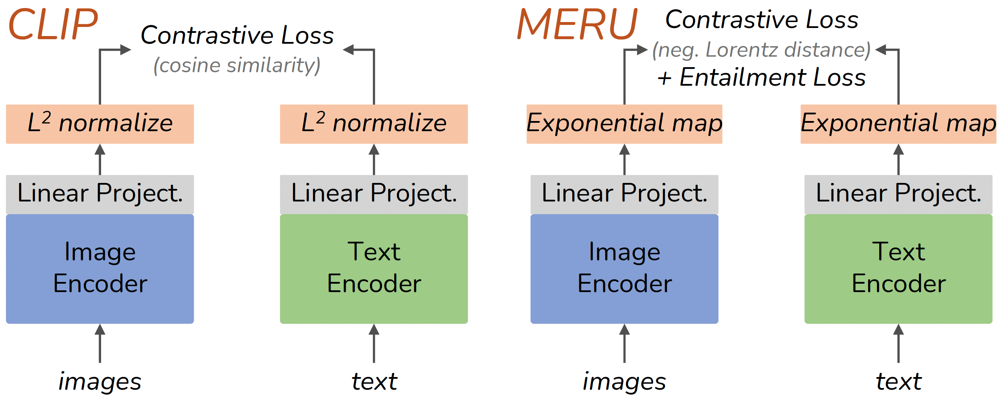
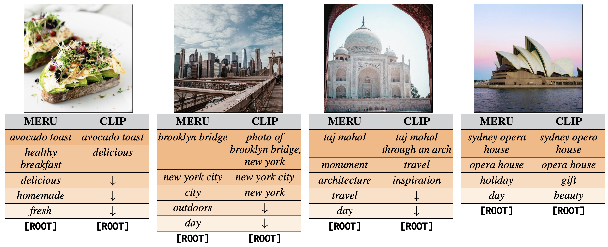

# Hyperbolic Image-Text Representations

[Karan Desai](https://kdexd.xyz/),
[Maximilian Nickel](https://mnick.github.io/),
[Tanmay Rajpurohit](http://tanmay.one/),
[Justin Johnson](https://web.eecs.umich.edu/~justincj/),
[Ramakrishna Vedantam](https://vrama91.github.io/)

**ICML 2023** [[`Paper`](https://arxiv.org/abs/2304.09172)] [[`BibTeX`](#citing-meru)]

<p align="center"></p>


## Installation

This code requires `python>=3.9`, as well as `pytorch>=1.7` and `torchvision>=0.8`.
We recommend using [Conda](https://conda.io/docs/user-guide/install/download.html)
to set up the codebase.

```
git clone git@github.com:facebookresearch/meru.git
cd meru
conda create -n meru python=3.9 --yes
conda activate meru
```

Install torch and torchvision following the instructions on [pytorch.org](https://pytorch.org).
Then install the remaining dependencies, and this codebase as a dev package:

```
python -m pip install --pre timm
python -m pip install -r requirements.txt
python setup.py develop
```


## Trained model checkpoints

We trained three MERU and CLIP models with Vision Transformers of different sizes (small, base, and large).
These models were trained using 12 million image-text pairs from the [RedCaps dataset](https://redcaps.xyz)
(120,000 iterations and batch size of 2048).
Click the links below to download model checkpoints.
Their training configs are available in [`./configs`](./configs) directory.

- Model: [MERU ViT-large](https://dl.fbaipublicfiles.com/meru/meru_vit_l.pth) and config: [train_meru_vit_l.py](./configs/train_meru_vit_l.py)
- Model: [MERU ViT-base](https://dl.fbaipublicfiles.com/meru/meru_vit_b.pth) and config: [train_meru_vit_b.py](./configs/train_meru_vit_b.py)
- Model: [MERU ViT-small](https://dl.fbaipublicfiles.com/meru/meru_vit_s.pth) and config: [train_meru_vit_s.py](./configs/train_meru_vit_s.py)
- Model: [CLIP ViT-large](https://dl.fbaipublicfiles.com/meru/clip_vit_l.pth) and config: [train_clip_vit_l.py](./configs/train_clip_vit_l.py)
- Model: [CLIP ViT-base](https://dl.fbaipublicfiles.com/meru/clip_vit_b.pth) and config: [train_clip_vit_b.py](./configs/train_clip_vit_b.py)
- Model: [CLIP ViT-small](https://dl.fbaipublicfiles.com/meru/clip_vit_s.pth) and config: [train_clip_vit_s.py](./configs/train_clip_vit_s.py)


## Image traversals

<p align="center">
    
</p>

Perform image traversals ([Section 5 in our paper](https://arxiv.org/abs/2304.09172))
in the representation space of our trained models (ViT-large only).
This repository includes a few images from [pexels.com](https://pexels.com) to reproduce the figure above.

Run the following command for a single image with MERU:

```
python scripts/image_traversals.py --image-path assets/taj_mahal.jpg \
    --checkpoint-path checkpoints/meru_vit_l.pth --train-config configs/train_meru_vit_l.py
```

Try with your own images!
Note that we retrieve from a limited set of 750 captions collected from pexels.com
as provided in `assets/pexels_text.json`.
You may want to expand this set if your images contain visual concepts outside this set.


## Evaluate trained models

This codebase supports evaluation on **22 datasets** on three types of tasks.
See the instructions below.

1. **Zero-shot image classification:**

Download and symlink the ImageNet dataset ([Torchvision ImageFolder](https://pytorch.org/vision/main/generated/torchvision.datasets.ImageFolder.html)
style) at `./datasets/eval/imagenet`. The evaluation script will auto-download and cache
all other 19 datasets in `./datasets/eval`.
Run the following command to evaluate MERU ViT-large on 20 datasets:

```
python scripts/evaluate.py --config configs/eval_zero_shot_classification.py \
    --checkpoint-path checkpoints/meru_vit_l.pth \
    --train-config configs/train_meru_vit_l.py
```

2. **Zero-shot image and text retrieval:**

Two datasets are supported, COCO captions and Flickr30k captions.
Refer to the documentation in [`meru/data/evaluation.py`](./meru/data/evaluation.py) on how to
arrange their files in `./datasets/coco` and `./datasets/flickr30k`.

```
python scripts/evaluate.py --config configs/eval_zero_shot_retrieval.py \
    --checkpoint-path checkpoints/meru_vit_l.pth \
    --train-config configs/train_meru_vit_l.py
```

3. **Linear probe classification:**

This evaluation is supported for datasets included in zero-shot image classification.

```
python scripts/evaluate.py --config configs/eval_linprobe_classification.py \
    --checkpoint-path checkpoints/meru_vit_l.pth \
    --train-config configs/train_meru_vit_l.py
```


## Training your own MERU or CLIP models

### Training data

This codebase supports training models using the [RedCaps dataset](https://redcaps.xyz).
Use the [RedCaps downloader tool](https://github.com/redcaps-dataset/redcaps-downloader) and follow the instructions to
[download the dataset](https://github.com/redcaps-dataset/redcaps-downloader#basic-usage-download-official-redcaps-dataset)
and further [organize as TAR files](https://github.com/redcaps-dataset/redcaps-downloader#organizing-the-dataset-as-tar-files).

The dataset is expected relative to the project repository as follows:

```shell
meru  # project repository.
└── datasets
    └── redcaps
        ├── shard_00000000.tar
        ├── shard_00000001.tar
        └── {any_name}.tar
```

This dataset format is general enough to support training with similar image-text datasets
like Conceptual Captions ([12M](https://arxiv.org/abs/2102.08981), [3M](https://aclanthology.org/P18-1238/)),
if they are structured as TAR files described above.


### Training command

Train a MERU ViT-large model with the default hyperparameters as follows:

```bash
python scripts/train.py --config configs/train_meru_vit_l.py --num-gpus 8 --output-dir ./output
```

We follow [Detectron2-style lazy configs](https://detectron2.readthedocs.io/en/latest/tutorials/lazyconfigs.html)
that allow writing [Hydra-like](https://hydra.cc/) configs in Python.
Each config file is expected to have four dictionary-like objects in global scope: `dataset`, `model`, `optim`, and `train`.

We can easily modify hyperparameters directly via the command line.
For example, train a MERU ViT-base model with larger batch size, add
`model.visual.arch=vit_base_patch16_224 train.total_batch_size=4096` to the command.


## Citing MERU

If you use any parts of this codebase in your research, please use the following BibTeX entry.

```
@inproceedings{desai2023meru,
    title     = {{Hyperbolic Image-Text Representations}},
    author    = {Desai, Karan and Nickel, Maximilian and Rajpurohit, Tanmay and Johnson, Justin and Vedantam, Ramakrishna}
    booktitle = {Proceedings of the International Conference on Machine Learning},
    year      = {2023}
}
```

The majority of the MERU project is licensed under CC-BY-NC, however portions of the project are available under separate license terms:
https://github.com/openai/clip, https://github.com/facebookresearch/slip, and https://github.com/kdexd/virtex are licensed under the MIT license.

**Image credits:**

- [`avocado_toast.jpg`](./assets/avocado_toast.jpg): [pexels.com link](https://www.pexels.com/photo/avocado-toast-served-on-white-plate-10464867)
- [`new_york.jpg`](./assets/taj_mahal.jpg): [pexels.com link](https://www.pexels.com/photo/photo-of-brooklyn-bridge-new-york-2260783)
- [`taj_mahal.jpg`](./assets/taj_mahal.jpg): [pexels.com link](https://www.pexels.com/photo/taj-mahal-through-an-arch-2413613)
- [`sydney_opera.jpg`](./assets/sydney_opera.jpg): [pexels.com link](https://www.pexels.com/photo/sydney-opera-house-7088958)

We thank the photographers for generously sharing them for free use.

